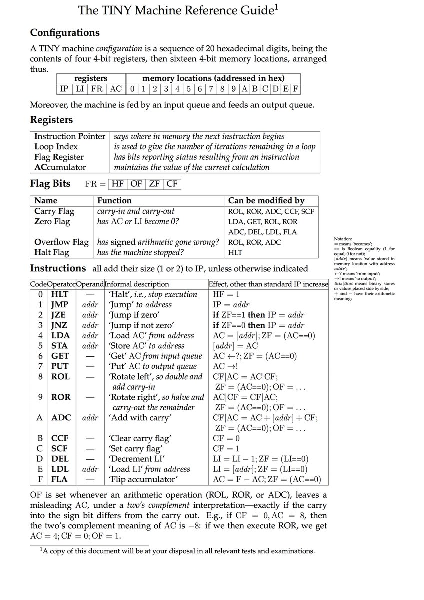

# TINY Machine Emulator
This is an emulator for the TINY machine, which is a 4-bit Von Neumann architecture.

I first encountered the TINY machine specification through [Conor McBride](http://strictlypositive.org/), though I do not know if it was his original work.

## Demonstration
The demonstration available in [`test/Spec.hs`](test/Spec.hs) is an example of a quine.  Running the test -- for example, by `stack test` -- will initialize a TINY computer's memory with the program `4F5545745CAF3200` and then trace its execution until the computer halts.  The output produced will be exactly the original program: `4F5545745CAF3200`.

## Design choices
I made use of the `Control.Lens` library in part because I was curious how it would behave in practice.  I find it remarkably useful to inspect and update parts of a multi-layered conceptual structure, with the flexibility to accommodate both field-style ("get me this register") and indexed ("get me this memory location") references into substructures. 

## Future work
While the current list-based input and output streams are sufficient for the demonstration, I would like to rewrite them to use a streaming approach that could either take characters from stdin and write them to stdout in a main executable, or read from and write to lists of characters in a testing context.
